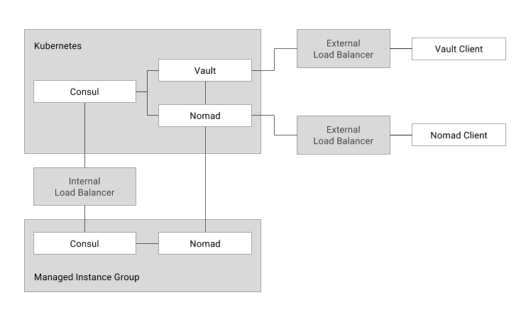

# Nomad on Kubernetes

The Nomad on Kubernetes tutorial documents how to deploy [Nomad](https://www.nomadproject.io/) on [Kubernetes](https://kubernetes.io/). The following diagram provides a high level overview of the Nomad on Kubernetes architecture.



The following components will be deployed to a Kubernetes cluster with minimal CPU and memory allocations to control cost:

* [Consul](https://www.consul.io/) 0.9.2
* [Vault](https://www.vaultproject.io/) 0.8.0
* [Nomad](https://www.nomadproject.io/) 0.6.0

## Rational

Nomad and Kubernetes [have many similarities](https://www.nomadproject.io/intro/vs/kubernetes.html) in terms of managing applications but have also been found to [complement each other](https://stackshare.io/circleci/how-circleci-processes-4-5-million-builds-per-month). Kubernetes offers a set of APIs that ease the deployment and management of stateful distributed systems such as Consul, Nomad, and Vault.

Using Kubernetes to deploy and manage Nomad presents an opportunity for learning some of Kubernetes more advanced features including:

* [Advanced Scheduling: Affinity and Anti-affinity](https://kubernetes.io/docs/concepts/configuration/assign-pod-node/)
* [Dynamic Storage Provisioning](https://kubernetes.io/docs/concepts/storage/persistent-volumes/#dynamic)
* [Support for Stateful Applications](https://kubernetes.io/docs/concepts/workloads/controllers/statefulset/)

## Tutorial

* [Prerequisites](docs/01-prerequisites.md)
* [Install Client Tools](docs/02-client-tools.md)
* [Provision The Kubernetes Infrastructure](docs/03-kubernetes-infrastructure.md)
* [Provision The Nomad Infrastructure](docs/04-nomad-infrastructure.md)
* [Provision The Consul Cluster](docs/05-consul.md)
* [Provision The Vault Service](docs/06-vault.md)
* [Provision The Nomad Servers](docs/07-nomad.md)
* [Provision the Nomad Worker Nodes](docs/08-nomad-worker-nodes.md)
* [Running Nomad Jobs](docs/09-nomad-jobs.md)
* [The Consul UI](docs/10-consul-ui.md)

### Clean up

Run the `clean-up` bash script to remove all compute resources created by this tutorial:

```
bash clean-up
```
