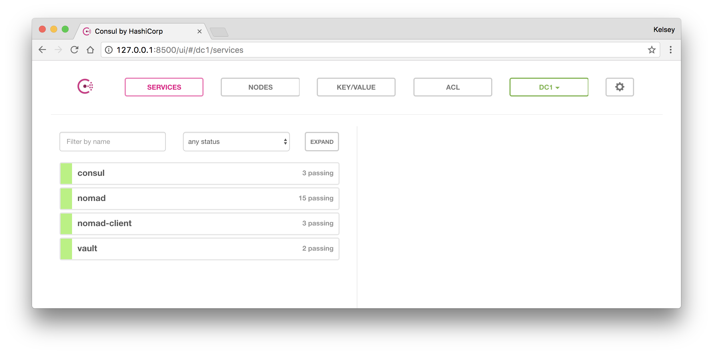

# Consul UI

Consul ships with a dashboard to help visualize the health of the Consul, Vault, and Nomad components. The Consul UI does not offer authentication so it's advised not to expose it directly to the public internet. In this section the `kubectl` command will be used to proxy the Consul dashboard over a secure HTTP tunnel.

## Proxy the Consul UI

Use the `kubectl` command to proxy the Consul UI:

```
kubectl port-forward consul-0 8500:8500
```

```
Forwarding from 127.0.0.1:8500 -> 8500
Forwarding from [::1]:8500 -> 8500
```

At this point the Consul UI is available at http://127.0.0.1:8500/ui


